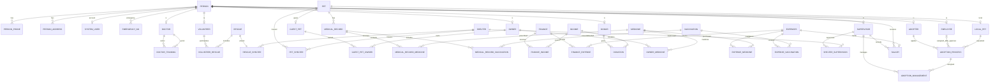

# Final relational schema diagram

Paste this Mermaid code into Mermaid Live Editor when a printable schema diagram is needed.

```mermaid
erDiagram
  PERSON ||--o{ PERSON_PHONE : has
  PERSON ||--o{ PERSON_ADDRESS : has
  PERSON ||--o| SYSTEM_USER : account
  PERSON ||--o{ EMERGENCY_NO : emergency
  PERSON ||--o| DOCTOR : is
  PERSON ||--o| VOLUNTEER : is
  PERSON ||--o| SUPERVISOR : is
  PERSON ||--o| EMPLOYEE : is
  PERSON ||--o| ADOPTER : is
  PERSON ||--o| DONOR : is
  PERSON ||--o| OWNER : is
  DOCTOR ||--o{ DOCTOR_TRAINING : senior
  DOCTOR ||--o{ DOCTOR_TRAINING : junior
  VOLUNTEER ||--o{ VOLUNTEER_RESCUE : participates
  RESCUE ||--o{ VOLUNTEER_RESCUE : includes
  RESCUE ||--|| RESCUE_SHELTER : placed
  SHELTER ||--o{ RESCUE_SHELTER : receives
  PET ||--o| LOCAL_PET : local
  PET ||--o| GUEST_PET : guest
  PET ||--o{ PET_SHELTER : housed
  SHELTER ||--o{ PET_SHELTER : houses
  GUEST_PET ||--o{ GUEST_PET_OWNER : owned
  OWNER ||--o{ GUEST_PET_OWNER : owns
  PET ||--o{ MEDICAL_RECORD : has
  MEDICAL_RECORD ||--o{ MEDICAL_RECORD_MEDICINE : contains
  MEDICINE ||--o{ MEDICAL_RECORD_MEDICINE : prescribed
  MEDICAL_RECORD ||--o{ MEDICAL_RECORD_VACCINATION : includes
  VACCINATION ||--o{ MEDICAL_RECORD_VACCINATION : recorded
  FINANCE ||--o{ FINANCE_INCOME : receives
  INCOME ||--o{ FINANCE_INCOME : source
  FINANCE ||--o{ FINANCE_EXPENSE : records
  EXPENSES ||--o{ FINANCE_EXPENSE : source
  DONOR ||--o{ DONATION : gives
  INCOME ||--o{ DONATION : donation
  OWNER ||--o{ OWNER_MEDICINE : converted
  MEDICINE ||--o{ OWNER_MEDICINE : medicine
  EXPENSES ||--o{ EXPENSE_MEDICINE : has
  MEDICINE ||--o{ EXPENSE_MEDICINE : purchased
  EXPENSES ||--o{ EXPENSE_VACCINATION : contains
  VACCINATION ||--o{ EXPENSE_VACCINATION : purchased
  SUPERVISOR ||--o{ SHELTER_SUPERVISION : supervises
  SHELTER ||--o{ SHELTER_SUPERVISION : supervised
  ADOPTER ||--o{ ADOPTION_PROCESS : applies
  EMPLOYEE o|--o{ ADOPTION_PROCESS : assigned_after_approval
  LOCAL_PET ||--o{ ADOPTION_PROCESS : requested
  SUPERVISOR ||--o{ ADOPTION_MANAGEMENT : manages
  ADOPTION_PROCESS ||--o{ ADOPTION_MANAGEMENT : assigned
  SUPERVISOR ||--o{ SALARY : records
  PERSON ||--o{ SALARY : receives
  EXPENSES ||--o| SALARY : funds
```
